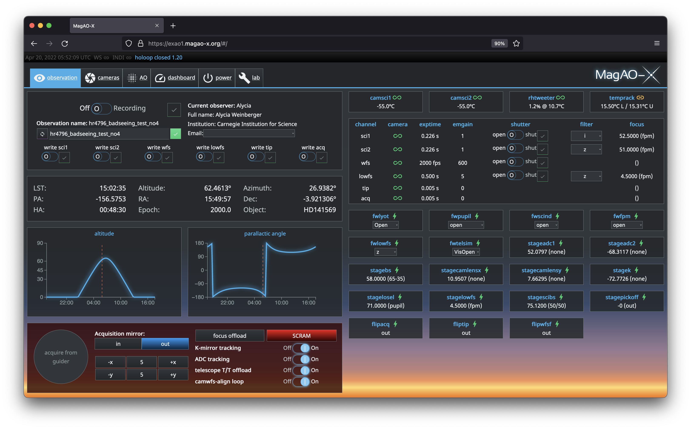

# sup

The MagAO-X web user interface in [Vue.js 2](https://v2.vuejs.org/) and async Python with [Starlette](https://www.starlette.io/). Built with [PurePyINDI2](https://github.com/xwcl/purepyindi2/).



This application uses the Parcel bundler (v. 1.x). There is of course a version 2.0 that has all-new bugs, and we'll transition some day, maybe.

## Development

There is a Makefile that provides `init`, `justjs`, and `servejs` targets (among others). A typical workflow would start with using `make init` to install the Python portion of sup in editable mode (`pip install -e ...`) and the JavaScript dependencies with `yarn install` from the `frontend/` directory.

### Python

The Python code is a Starlette ASGI app. In MagAO-X, it's launched by a SystemD unit:

```
[Unit]
Description=MagAO-X Web UI
Requires=network.target
After=network.target

[Service]
User=xsup
WorkingDirectory=/home/xsup
ExecStart=/opt/conda/envs/sup/bin/sup

[Install]
WantedBy=default.target
```

(Note that for MagAO-X there's a `sup` env created in `/opt/conda` used by this app.)

The entry-point is a console command `sup` installed by `pip install`. It invokes the `WebInterface.run` class method in `core.py`, which invokes `WebInterface.main`, which calls `uvicorn.run`.

The config is read from `/opt/MagAOX/config/gui_sup.conf`, a TOML file. The effective config is shown with `sup --dump-config`:

```toml
layout = "magaox"
bind_host = "127.0.0.1"
bind_port = 8000
potemkin = false
debug_mode = true
batch_update_interval_sec = 0.2

[indi]
hostname = "localhost"
port = 7624
```

This is also the configuration used in the absence of a `gui_sup.conf` file. Configurable properties are mostly documented in the help:

```
% sup -h
usage: sup [-c CONFIG_FILE] [-h] [-v] [--dump-config] [vars ...]

positional arguments:
  vars                  Config variables set with 'key.key.key=value' notation

options:
  -c CONFIG_FILE, --config-file CONFIG_FILE
                        Path to config file, repeat to merge multiple, last one
                        wins for repeated top-level keys
  -h, --help            Print usage information
  -v, --verbose         Enable debug logging
  --dump-config         Dump final configuration state as TOML and exit

configuration keys:
  layout
      str
     (default: 'magaox')
  bind_host
      str
    Listening address (0.0.0.0 for all) (default: '127.0.0.1')
  bind_port
      int
    Listening TCP port (default: 8000)
  indi
      IndiConfig
     (default: IndiConfig(hostname='localhost', port=7624))
  indi.hostname
      str
    Hostname of INDI server (default: 'localhost')
  indi.port
      int
    Port number of INDI server (default: 7624)
  potemkin
      bool
    Whether to load a system snapshot for testing (disables connection
    to INDI server) (default: False)
  debug_mode
      bool
    Initialize Starlette framework in debug mode (default: True)
  batch_update_interval_sec
      float
    How often to emit a batch of updates over the websocket to
    connected clients (default: 0.2)
```

### JavaScript

Most interesting stuff is in `*.vue` single-file component files, which combine HTML with JavaScript and stylesheet information.

Visual Studio Code with the official Vue extension improves development considerably.

If you use `make servejs`, you launch the bundler in live-reload mode, which saves time. The "live" part of live-reloading is not an easy thing to do in general, so you probably need to reload the page on changes. You will *also* need the Python server process running on port 8000 for the connection to MagAO-X to work. (You can use the `sup` command to launch it, and port 8000 is default.)

The entry point is the `index.html` file, which loads `index.js`, which displays `App.vue` as its root component.

WebSocket connection / reconnection is kind of hard to find, but it's in the `mounted` hook for the `common.js` mixin used in `index.js`. (It is common *not* to all components, but to all *top-level* components, of which there is currently one non-trivial example.)
